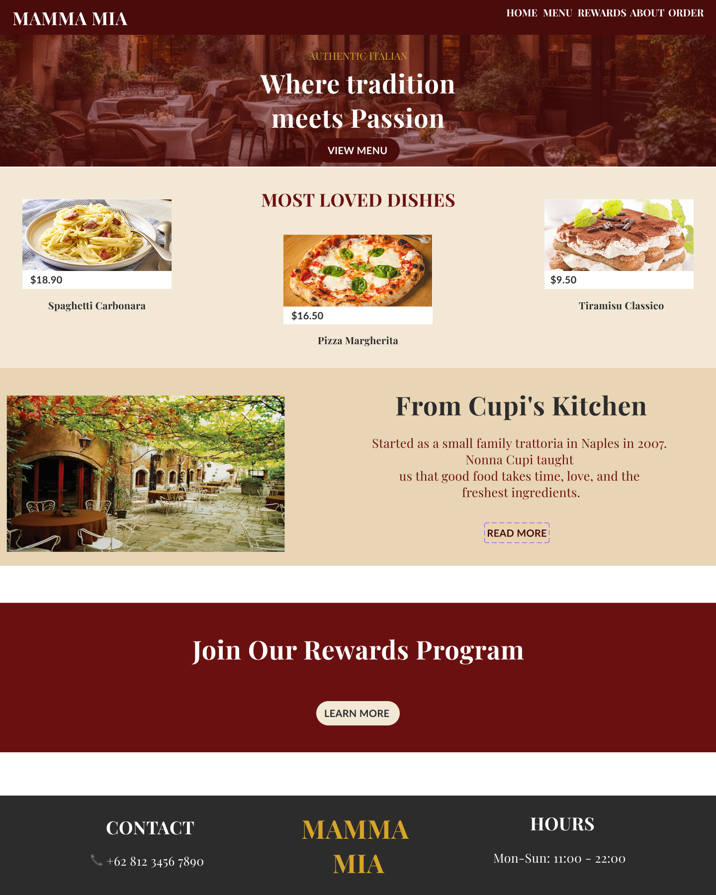
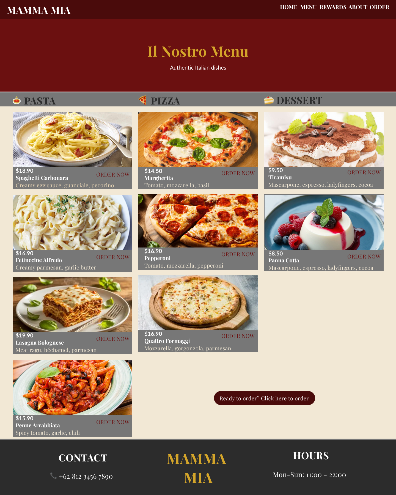
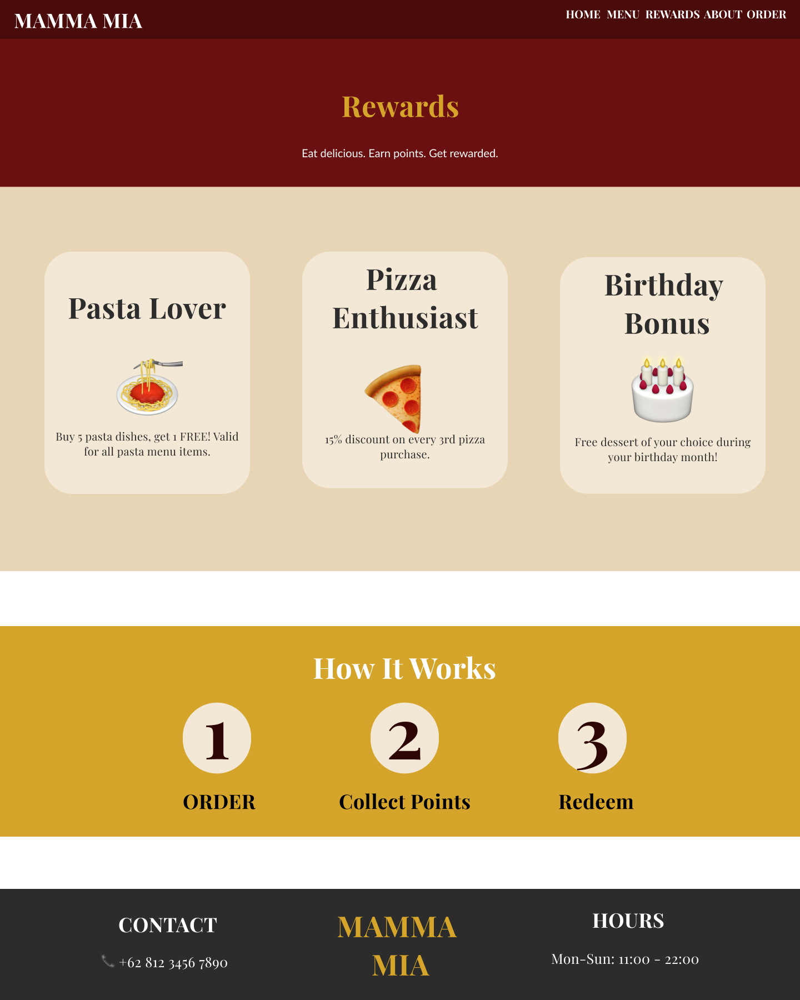
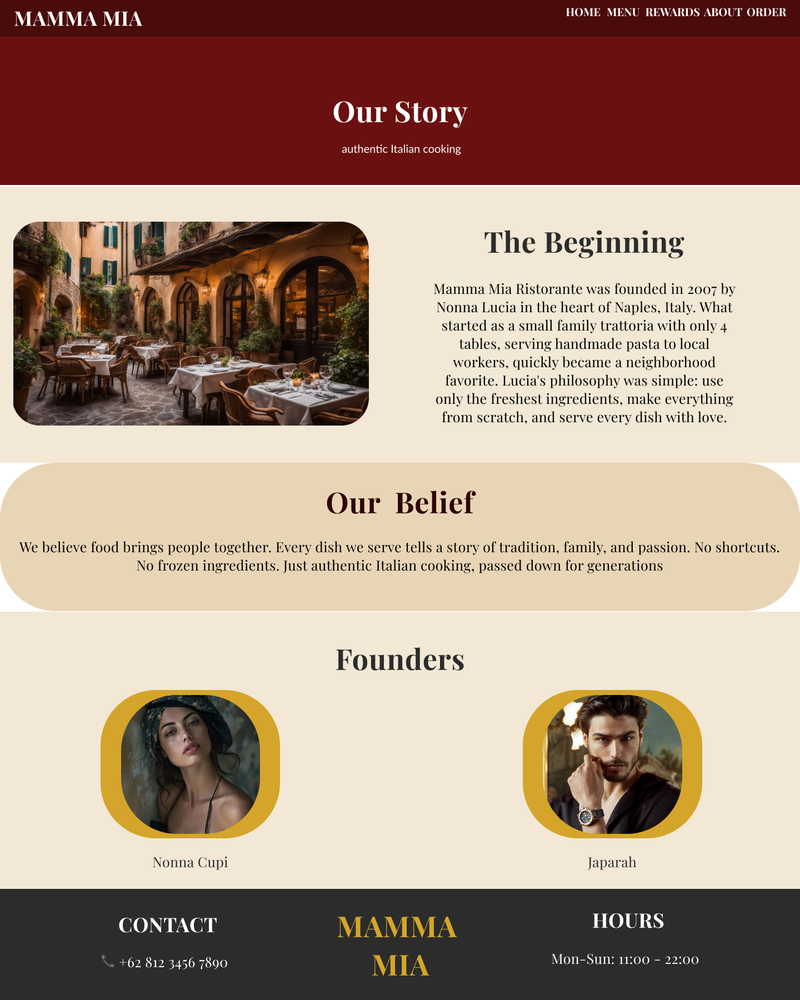
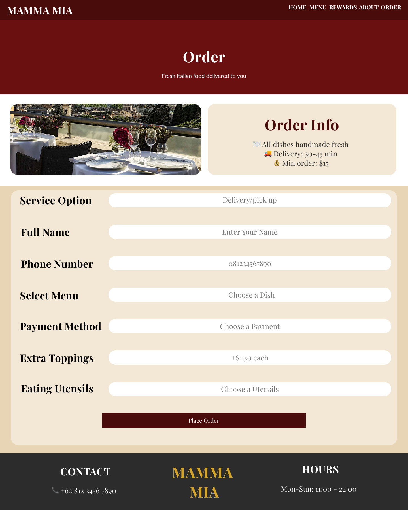

# Mama Mia

Mama Mia restaurant website. Built with HTML, CSS, and JavaScript.

## Features
- Home page
- Menu page
- Rewards page
- About page
- Order page

## UI Design
View the interactive prototype on Figma: https://www.figma.com/proto/Bk7bTrFROds1hLqDpDnoDb/Mamma-Mia?node-id=16-192&t=MMS7M6dDxcYthecV-1&scaling=min-zoom&content-scaling=fixed&page-id=0%3A1

### Preview

## How to Run
1. Clone this repository
2. Open `index.html` in your browser

## Tech Stack
- HTML5
- CSS3
- JavaScript

## Author
Farah Ayu Febrianti